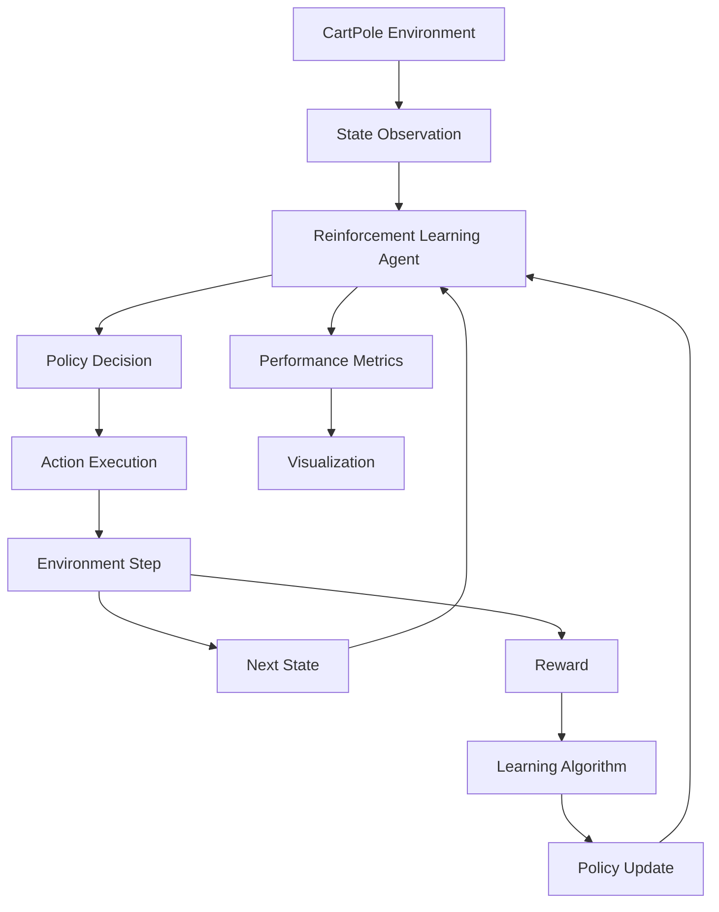
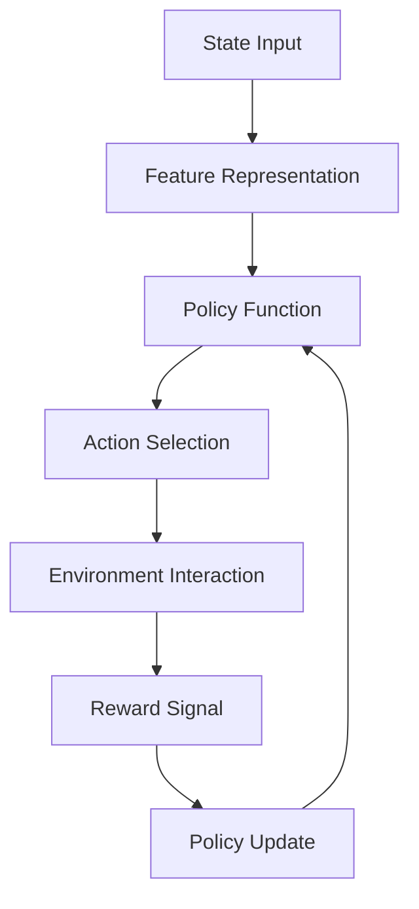
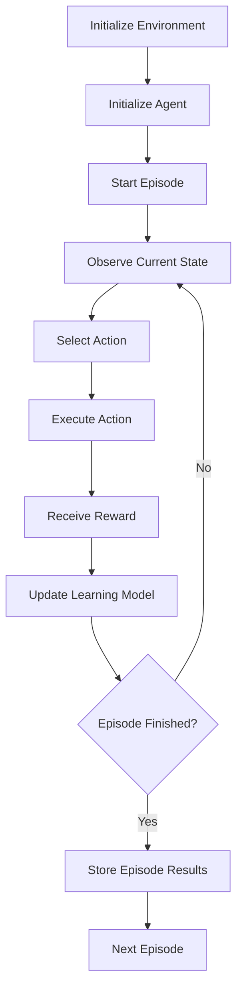
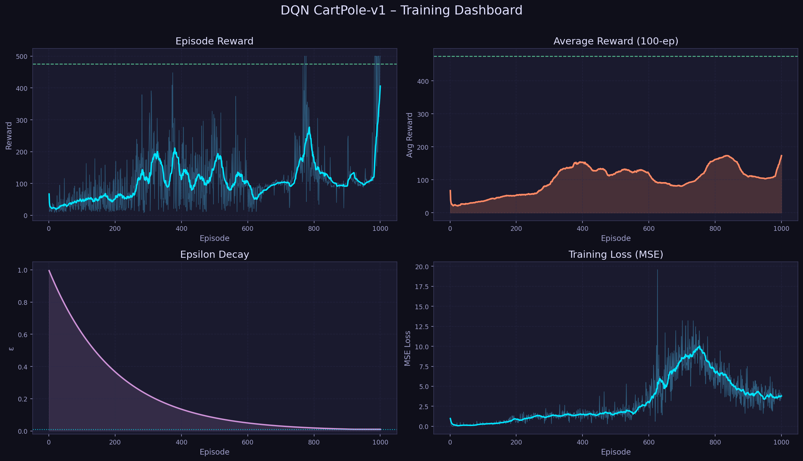
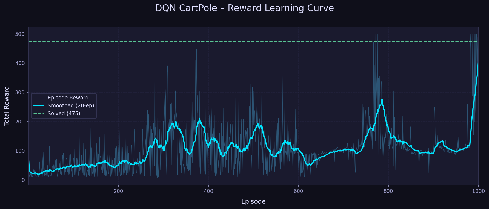
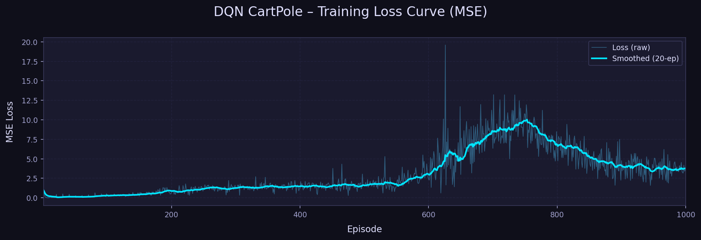
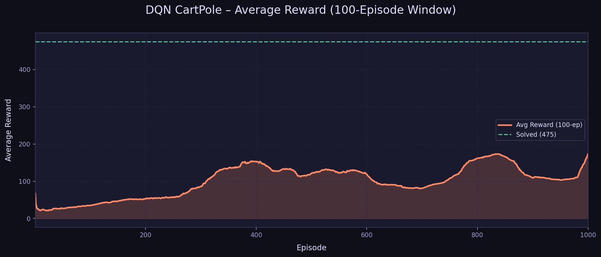
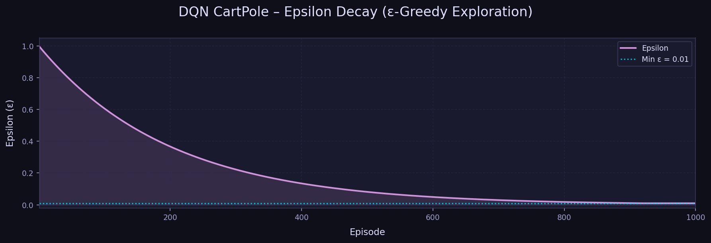

# 🤖 Cart Pole Balancing using Reinforcement Learning

<div align="center">


*A production-quality Deep Reinforcement Learning project that trains an intelligent agent to balance a pole on a moving cart — solving CartPole-v1 from scratch.*

</div>

## 📍 Table of Contents

  * [🎬 Training Progression](https://www.google.com/search?q=%23-training-progression)
  * [📖 Overview](https://www.google.com/search?q=%23overview)
  * [🧠 What is Reinforcement Learning?](https://www.google.com/search?q=%23-what-is-reinforcement-learning)
  * [🔬 What is Deep Q-Learning (DQN)?](https://www.google.com/search?q=%23-what-is-deep-q-learning-dqn)
  * [🎮 Environment Details](https://www.google.com/search?q=%23-environment-details)
  * [🏗️ Algorithm Architecture](https://www.google.com/search?q=%23-algorithm-architecture)
  * [⚙️ Hyperparameters](https://www.google.com/search?q=%23-hyperparameters)
  * [📚 Key Concepts Explained](https://www.google.com/search?q=%23-key-concepts-explained)
  * [🛠️ Technology Stack](https://www.google.com/search?q=%23technology-stack)
  * [📐 Reinforcement Learning Framework](https://www.google.com/search?q=%23reinforcement-learning-framework)
  * [➗ Mathematical Formulation](https://www.google.com/search?q=%23mathematical-formulation)
  * [🏛️ System Architecture](https://www.google.com/search?q=%23system-architecture)
  * [📁 Project Structure](https://www.google.com/search?q=%23-project-structure)
  * [📈 Training Output & Results](https://www.google.com/search?q=%23training-output)
  * [🚀 Installation & Usage](https://www.google.com/search?q=%23installation)
  * [📧 Author & Contact](https://www.google.com/search?q=%23-author)

-----

## 🎬 Training Progression

Witness the agent's learning journey, starting from completely random actions to achieving a flawless balancing policy.

| Before Training (Random Policy) | After Training (Optimized DQN Policy) |
| :---: | :---: |
| <br><br> |  |
| *The agent struggles to keep the pole upright and quickly fails.* | *The agent smoothly balances the pole for the maximum 500 timesteps.* |


> *“Reinforcement learning is learning what to do—how to map situations to actions—so as to maximize a numerical reward signal.”*
> — **Richard S. Sutton & Andrew G. Barto, Reinforcement Learning: An Introduction**

---

# Overview

The **Cart-Pole Balancing Problem** is one of the most fundamental benchmark problems in **Reinforcement Learning (RL)** and **control systems**. The objective is to train an intelligent agent that learns how to balance a pole on a moving cart by applying forces to the cart either **left or right**.

This project implements a **Reinforcement Learning agent** capable of learning an optimal policy by interacting with the **CartPole environment** provided by **OpenAI Gym**.

Through repeated interactions with the environment, the agent learns to maximize cumulative reward by maintaining the pole in a vertical position.

The system demonstrates:

* Reinforcement learning fundamentals
* Agent–environment interaction
* Policy optimization
* Training visualization
* Performance evaluation

---


## 🧠 What is Reinforcement Learning?

**Reinforcement Learning (RL)** is a machine learning paradigm where an **agent** learns to make decisions by interacting with an **environment** through trial and error.

```
       ┌──────────────────────────────────────────┐
       │                                          │
  ┌────▼────┐    Action (aₜ)    ┌──────────────┐  │
  │         │  ───────────────► │              │  │
  │  Agent  │                   │  Environment │  │
  │         │  ◄─────────────── │              │  │
  └─────────┘  State (sₜ₊₁)    └──────────────┘  │
               Reward (rₜ)                         │
       │                                          │
       └──────────────────────────────────────────┘
                    Closed-loop interaction
```

### Core Concepts

| Term | Definition |
|---|---|
| **Agent** | The learning entity (our DQN network) |
| **Environment** | The world the agent interacts with (CartPole) |
| **State (s)** | The current observation the agent receives |
| **Action (a)** | A decision the agent makes (left or right) |
| **Reward (r)** | Feedback signal (+1 each timestep pole stays up) |
| **Policy (π)** | The strategy that maps states to actions |
| **Episode** | One complete run from reset to termination |

The agent's goal: **maximise cumulative reward** over an episode.

---

## 🔬 What is Deep Q-Learning (DQN)?

**Q-Learning** is a model-free RL algorithm that learns the optimal *action-value function* **Q(s, a)**, which estimates the expected cumulative reward of taking action `a` in state `s` and following the optimal policy thereafter.

### The Bellman Equation

The optimal Q-function satisfies:

```
Q*(s, a) = r  +  γ · max_{a'} Q*(s', a')
```

Where:
- `r`  = immediate reward
- `γ`  = discount factor (how much future rewards matter)
- `s'` = next state after taking action `a`

### Why "Deep"?

In small problems, Q-values can be stored in a table. For CartPole's continuous state space, we use a **neural network** to approximate Q(s, a) for all actions simultaneously — this is **Deep Q-Learning**.

### DQN Innovations (Mnih et al., 2015)

| Innovation | Purpose |
|---|---|
| **Neural Network** | Approximate Q(s,a) in continuous state spaces |
| **Experience Replay** | Store past transitions and sample randomly to break temporal correlations |
| **Target Network** | Separate, slowly-updated network for stable TD targets |
| **ε-Greedy Exploration** | Balance exploration (random) and exploitation (greedy) |

### Training Process

```
For each step:
  1. Observe state s
  2. Select action a (ε-greedy)
  3. Execute a → receive (r, s')
  4. Store (s, a, r, s', done) in replay buffer
  5. Sample random mini-batch from buffer
  6. Compute target:  y = r + γ · max Q_target(s')
  7. Minimize loss:   L = MSE(Q_online(s,a), y)
  8. Update Q_online via backpropagation
  
Every 10 episodes:
  Q_target ← Q_online  (hard copy)
```

---

## 🎮 Environment Details

```
Environment: CartPole-v1 (Gymnasium)

                    ┃  ◄── Pole (angle θ)
                    ┃
         ┌──────────┸──────────┐
         │       Cart          │ ◄── Position x
         └─────────────────────┘
    ──────────────────────────────── Track
         ◄──  0  ──►
         Push LEFT   Push RIGHT
```

### State Space (4 continuous variables)

| Index | Variable | Range |
|---|---|---|
| 0 | Cart Position | [-4.8, 4.8] |
| 1 | Cart Velocity | (-∞, +∞) |
| 2 | Pole Angle (radians) | [-0.418, 0.418] |
| 3 | Pole Angular Velocity | (-∞, +∞) |

### Action Space

| Action | Meaning |
|---|---|
| 0 | Push cart **LEFT** |
| 1 | Push cart **RIGHT** |

### Reward & Termination

- **+1** reward for every timestep the pole stays upright
- Episode ends if:
  - Pole angle > ±12°
  - Cart position > ±2.4 units
  - 500 timesteps reached (success!)
- **Solved**: Average reward ≥ 475 over 100 consecutive episodes

---

## 🏗️ Algorithm Architecture

### Neural Network (Q-function Approximator)

```
Input Layer     Hidden Layer 1    Hidden Layer 2    Output Layer
(state_size=4)  (128 neurons)     (128 neurons)     (action_size=2)

   [cart_pos ]         ┌───┐         ┌───┐        [Q(s, LEFT) ]
   [cart_vel ]  ──►    │ReLU│  ──►   │ReLU│  ──►  [Q(s, RIGHT)]
   [pole_ang ]  ──►    │    │  ──►   │    │  ──►
   [pole_vel ]         └───┘         └───┘

   Xavier init    128 neurons    128 neurons    Linear (no activation)
```

### DQN Architecture Diagram

```
┌──────────────────────────────────────────────────────────────┐
│                       DQN AGENT                              │
│                                                              │
│  ┌─────────────┐        ┌──────────────────────────────┐    │
│  │ Environment │──state─►    Online Network Q_θ         │    │
│  │ CartPole-v1 │        │  (FC 4→128→128→2, ReLU)      │    │
│  └─────────────┘        └──────────────┬─────────────┘    │
│         ▲                              │ Q-values          │
│         │ action                       │                    │
│         │                    ε-greedy  ▼                    │
│         └────────────────── select_action()                 │
│                                                              │
│  ┌─────────────────────────────────────────────────────┐    │
│  │                  Replay Buffer                       │    │
│  │           (s, a, r, s', done) × 100K                │    │
│  └─────────────────────────┬──────────────────────────┘    │
│                             │ random mini-batch              │
│                             ▼                                │
│  ┌────────────────────────────────────────────────────┐     │
│  │   Target Network Q_θ'  (frozen, updated every 10ep) │    │
│  │   Computes stable Bellman targets:                   │    │
│  │   y = r + γ · max_a' Q_θ'(s', a')                   │    │
│  └────────────────────────────────────────────────────┘     │
│                             │                                │
│                             ▼                                │
│             Loss = MSE(Q_θ(s,a), y)                         │
│             Optimizer: Adam  →  ∂L/∂θ  →  update θ          │
│                                                              │
└──────────────────────────────────────────────────────────────┘
```
### Typical Learning Curve

```
Reward
 500 |                                          ****•••****
 475 |─ ─ ─ ─ ─ ─ ─ ─ ─ ─ ─ ─ ─ ─ ─ ─ ─ [SOLVED]─ ─ ─
 400 |                              ****
 300 |                        ****
 200 |                  ***
 100 |          **
  50 |  *
     └────────────────────────────────────────────────────
     0        200       400       600       800      1000
                          Episode
```

---

## ⚙️ Hyperparameters

All hyperparameters are configured at the top of `training/train.py`:

| Parameter | Value | Description |
|---|---|---|
| `total_episodes` | 1000 | Maximum training episodes |
| `learning_rate` | 0.001 | Adam optimizer learning rate |
| `gamma` | 0.99 | Discount factor for future rewards |
| `epsilon_start` | 1.0 | Initial exploration probability |
| `epsilon_min` | 0.01 | Minimum exploration probability |
| `epsilon_decay` | 0.995 | Per-episode multiplicative decay |
| `buffer_size` | 100,000 | Maximum replay buffer capacity |
| `batch_size` | 64 | Mini-batch size per training step |
| `target_update_ep` | 10 | Hard target network update interval |
| `hidden_size` | 128 | Neurons per hidden layer |
| `video_interval` | 100 | Record video every N episodes |

---

## 📚 Key Concepts Explained

### Experience Replay

Without replay, consecutive experiences are highly correlated (each state follows the previous). Training on correlated data leads to unstable Q-value updates. The replay buffer stores 100,000 transitions and samples **random mini-batches**, breaking temporal correlations.

### Target Network

Using the same network to compute both predictions and targets causes a moving target problem — the Q-values chase themselves. The **target network** is a frozen copy of the online network, updated every 10 episodes. This provides stable Bellman targets.

### ε-Greedy Exploration

At the start, the agent knows nothing — it explores randomly (ε=1.0). As it learns, ε decays exponentially, shifting toward exploitation of the learned Q-function, with a floor at ε=0.01 for minor continued exploration.

### Gradient Clipping

Applied with `max_norm=1.0` to prevent exploding gradients — a common issue in early training when Q-values are not yet calibrated.

---

# Technology Stack

| Category                         | Technology                        |
| -------------------------------- | --------------------------------- |
| Programming Language             | Python                            |
| Reinforcement Learning Framework | OpenAI Gym / Gymnasium            |
| Numerical Computing              | NumPy                             |
| Visualization                    | Matplotlib                        |
| Environment Simulation           | CartPole-v1                       |
| Development Tools                | Jupyter Notebook / Python Scripts |
| Version Control                  | Git + GitHub                      |

---

# Reinforcement Learning Framework

This project models the problem using a **Markov Decision Process (MDP)**.

An MDP is defined as:

```
MDP = (S, A, P, R, γ)
```

Where:

| Symbol | Meaning                |
| ------ | ---------------------- |
| S      | Set of states          |
| A      | Set of actions         |
| P      | Transition probability |
| R      | Reward function        |
| γ      | Discount factor        |

The agent learns a **policy π(s)** that maximizes expected rewards.

---

# Mathematical Formulation

The objective is to maximize the **expected cumulative reward**:

```
G_t = R_{t+1} + γR_{t+2} + γ²R_{t+3} + ...
```

The **optimal value function** is:

```
V*(s) = maxπ Eπ [Gt | St = s]
```

In reinforcement learning, the agent iteratively improves its policy to approximate the optimal value function.

---

# System Architecture

The system consists of several interacting components:

1. Environment Simulation
2. RL Agent
3. Policy Learning Module
4. Training Loop
5. Evaluation Module
6. Visualization System

---


# 📁 Project Structure

```
CartPole-DQN-Project/
│
├── env/
│   ├── __init__.py
│   └── cartpole_env.py          # Gymnasium CartPole-v1 wrapper
│
├── agent/
│   ├── __init__.py
│   └── dqn_agent.py             # DQN agent (action selection, learning, saving)
│
├── models/
│   ├── __init__.py
│   └── dqn_network.py           # PyTorch neural network (4→128→128→2)
│
├── utils/
│   ├── __init__.py
│   ├── replay_buffer.py         # Experience replay buffer
│   ├── plotting.py              # Matplotlib training plots (dark theme)
│   ├── video_recorder.py        # OpenCV episode video recorder
│   └── logger.py                # CSV training metrics logger
│
├── training/
│   ├── __init__.py
│   └── train.py                 # ← Main training script
│
├── evaluation/
│   ├── __init__.py
│   └── evaluate.py              # Evaluation script (greedy policy)
│
├── results/
│   ├── videos/                  # episode_0100.mp4, episode_0200.mp4, ...
│   ├── plots/                   # 01_reward_curve.png, 02_average_reward.png, ...
│   └── logs/                    # training_log.csv
│
├── requirements.txt
└── README.md
```
---
# High Level Architecture



---

# Agent Learning Architecture



---

# Training Workflow



---

# Training Output

During training, the system generates comprehensive performance metrics and visualizations to track the agent's learning progress. These plots are automatically saved in the `results/plots/` directory.

### 📊 Training Dashboard

The training dashboard provides a consolidated view of all key metrics, including reward trends and loss convergence.

### 📈 Detailed Performance Metrics

| Metric | Visualization | Description |
| :--- | :---: | :--- |
| **Reward Curve** |  | Shows the total reward achieved in each episode. |
| **Average Reward** |  | A smoothed curve showing the rolling average of rewards to indicate stability. |
| **Epsilon Decay** |  | Tracks the transition from exploration to exploitation over time. |
| **Loss Curve** |  | Displays the Mean Squared Error (MSE) loss of the neural network during training. |

-----
## Expected Terminal Output (Training)

```
============================================================
   DQN CartPole-v1 – Training
============================================================
[DQNAgent] Using device: cpu
[Logger] Logging to: results/logs/training_log.csv

Training:  15%|████▌         | 150/1000 [02:31, reward=73, avg100=65.3, epsilon=0.473]

[Episode 200] Recording video ...
[VideoRecorder] Saved: results/videos/episode_0200.mp4  (143 frames)

✓ Environment SOLVED at episode 487! Avg reward = 477.2 (elapsed: 412.3s)

[Plots] Generating plots in 'results/plots' ...
[Plot] Saved: results/plots/01_reward_curve.png
[Plot] Saved: results/plots/02_average_reward.png
[Plot] Saved: results/plots/03_epsilon_decay.png
[Plot] Saved: results/plots/04_loss_curve.png
[Plot] Saved: results/plots/00_training_dashboard.png

============================================================
          TRAINING COMPLETE
============================================================
  Total Episodes       : 487
  Best Episode Reward  : 500.0
  Final Avg Reward     : 477.2
  Total Training Time  : 0:06:52
  Log saved to         : results/logs/training_log.csv
============================================================
```

---

## 📊 Results

### 📈 Training Performance

After training, the following diagnostic plots are generated to visualize the agent's learning process.

#### 🏗️ Training Dashboard


#### 🔬 Key Metrics Breakdown

| 🏆 Reward Curve | 📉 Loss Curve |
|:---:|:---:|
|  |  |

| 🎯 Average Reward (Rolling 100) | 🕯️ Epsilon Decay |
|:---:|:---:|
|  |  |

---

# Installation

Clone the repository

```bash
git clone https://github.com/RutujaKumbhar17/Cart-Pole-Balancing-Program-Using-Reinforcement-Learning.git
```

Navigate into project directory

```bash
cd Cart-Pole-Balancing-Program-Using-Reinforcement-Learning
```

Install dependencies

```bash
pip install -r requirements.txt
```

---

# Running the Project

Execute the training script:

```bash
python cartpole.py
```

The agent will begin interacting with the environment and learning the balancing strategy.

---

# Training Output

During training the system generates:

* Episode rewards
* Learning curves
* Performance metrics
* Training statistics

Example plots:

* Reward vs Episode
* Average Reward Curve
* Learning Stability

---

# Expected Results

As training progresses:

* Episode rewards gradually increase
* Agent learns optimal control policy
* Pole balancing duration improves

Eventually the system learns to **maintain balance for extended time periods**.

---

# Applications

Although CartPole is a benchmark problem, the underlying techniques apply to real-world problems such as:

* Robotics control systems
* Autonomous vehicles
* Industrial automation
* Game AI
* Decision making systems
* Adaptive control systems

---

# Author
 ## 📧 Connect with Me
**Rutuja Maruti Kumbhar**

- 🌐 [My Portfolio](https://rutujakumbhar.netlify.app)

- 💼 [My LinkedIn](https://www.linkedin.com/in/rutuja-kumbhar-a7311b2a9/)

- 👨‍💻 [My GitHub](https://github.com/RutujaKumbhar17)

- 📧 [Email Id](https://rutujakumbhar.prof@gmail.com)


