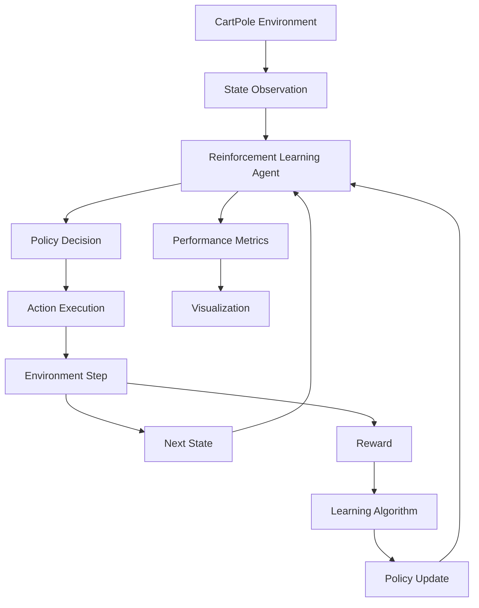
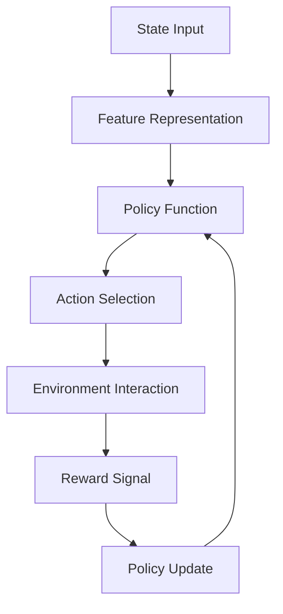
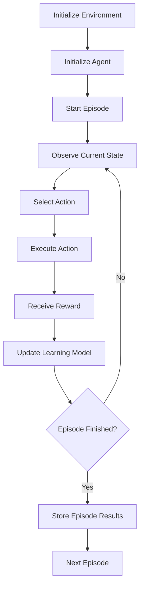

# 🤖 Cart Pole Balancing using Reinforcement Learning

<div align="center">


*A production-quality Deep Reinforcement Learning project that trains an intelligent agent to balance a pole on a moving cart — solving CartPole-v1 from scratch.*

</div>

---

## 🎬 Training Progression

Witness the agent's learning journey, starting from completely random actions to achieving a flawless balancing policy.

| Before Training (Random Policy) | After Training (Optimized DQN Policy) |
| :---: | :---: |
| <br><br> |  |
| *The agent struggles to keep the pole upright and quickly fails.* | *The agent smoothly balances the pole for the maximum 500 timesteps.* |


> *“Reinforcement learning is learning what to do—how to map situations to actions—so as to maximize a numerical reward signal.”*
> — **Richard S. Sutton & Andrew G. Barto, Reinforcement Learning: An Introduction**

---

# Overview

The **Cart-Pole Balancing Problem** is one of the most fundamental benchmark problems in **Reinforcement Learning (RL)** and **control systems**. The objective is to train an intelligent agent that learns how to balance a pole on a moving cart by applying forces to the cart either **left or right**.

This project implements a **Reinforcement Learning agent** capable of learning an optimal policy by interacting with the **CartPole environment** provided by **OpenAI Gym**.

Through repeated interactions with the environment, the agent learns to maximize cumulative reward by maintaining the pole in a vertical position.

The system demonstrates:

* Reinforcement learning fundamentals
* Agent–environment interaction
* Policy optimization
* Training visualization
* Performance evaluation

---

# Problem Statement

The **CartPole system** consists of:

* A cart moving along a horizontal track
* A pole attached to the cart via a frictionless joint

The agent must control the cart's movement to keep the pole balanced.

### State Space

The environment provides four state variables:

| State Variable        | Description                          |
| --------------------- | ------------------------------------ |
| Cart Position         | Position of cart on track            |
| Cart Velocity         | Speed of cart movement               |
| Pole Angle            | Angle between pole and vertical axis |
| Pole Angular Velocity | Rate of pole rotation                |

### Action Space

Two discrete actions are available:

| Action | Description            |
| ------ | ---------------------- |
| 0      | Push cart to the left  |
| 1      | Push cart to the right |

### Reward Function

The agent receives:

```
Reward = +1 for every timestep the pole remains balanced
```

The episode ends when:

* Pole angle exceeds threshold
* Cart moves out of bounds
* Maximum steps are reached

---

# Technology Stack

| Category                         | Technology                        |
| -------------------------------- | --------------------------------- |
| Programming Language             | Python                            |
| Reinforcement Learning Framework | OpenAI Gym / Gymnasium            |
| Numerical Computing              | NumPy                             |
| Visualization                    | Matplotlib                        |
| Environment Simulation           | CartPole-v1                       |
| Development Tools                | Jupyter Notebook / Python Scripts |
| Version Control                  | Git + GitHub                      |

---

# Reinforcement Learning Framework

This project models the problem using a **Markov Decision Process (MDP)**.

An MDP is defined as:

```
MDP = (S, A, P, R, γ)
```

Where:

| Symbol | Meaning                |
| ------ | ---------------------- |
| S      | Set of states          |
| A      | Set of actions         |
| P      | Transition probability |
| R      | Reward function        |
| γ      | Discount factor        |

The agent learns a **policy π(s)** that maximizes expected rewards.

---

# Mathematical Formulation

The objective is to maximize the **expected cumulative reward**:

```
G_t = R_{t+1} + γR_{t+2} + γ²R_{t+3} + ...
```

The **optimal value function** is:

```
V*(s) = maxπ Eπ [Gt | St = s]
```

In reinforcement learning, the agent iteratively improves its policy to approximate the optimal value function.

---

# System Architecture

The system consists of several interacting components:

1. Environment Simulation
2. RL Agent
3. Policy Learning Module
4. Training Loop
5. Evaluation Module
6. Visualization System

---
# Project Architecture
```

CartPole-DQN-Project/
├── agent/
│   └── dqn_agent.py             # DQN agent logic (action selection, learning, memory)
├── env/
│   └── cartpole_env.py          # Gymnasium environment wrapper
├── evaluation/
│   └── evaluate.py              # Script to run greedy evaluation episodes
├── models/
│   └── dqn_network.py           # PyTorch MLP architecture
├── results/                     # Auto-generated during training
│   ├── logs/                    # training_log.csv
│   ├── plots/                   # Reward curves, loss graphs, dashboards
│   └── videos/                  # MP4 recordings of episodes
├── training/
│   └── train.py                 # Main execution script
├── utils/
│   ├── logger.py                # CSV metric logger
│   ├── plotting.py              # Matplotlib visualizations
│   ├── replay_buffer.py         # Experience replay implementation
│   └── video_recorder.py        # OpenCV video generator
├── requirements.txt
└── README.md

```
# High Level Architecture



---

# Agent Learning Architecture



---

# Training Workflow



---


# Installation

Clone the repository

```bash
git clone https://github.com/RutujaKumbhar17/Cart-Pole-Balancing-Program-Using-Reinforcement-Learning.git
```

Navigate into project directory

```bash
cd Cart-Pole-Balancing-Program-Using-Reinforcement-Learning
```

Install dependencies

```bash
pip install -r requirements.txt
```

---

# Running the Project

Execute the training script:

```bash
python cartpole.py
```

The agent will begin interacting with the environment and learning the balancing strategy.

---

# Training Output

During training the system generates:

* Episode rewards
* Learning curves
* Performance metrics
* Training statistics

Example plots:

* Reward vs Episode
* Average Reward Curve
* Learning Stability

---

# Expected Results

As training progresses:

* Episode rewards gradually increase
* Agent learns optimal control policy
* Pole balancing duration improves

Eventually the system learns to **maintain balance for extended time periods**.

---

# Applications

Although CartPole is a benchmark problem, the underlying techniques apply to real-world problems such as:

* Robotics control systems
* Autonomous vehicles
* Industrial automation
* Game AI
* Decision making systems
* Adaptive control systems

---

# Future Improvements

Potential enhancements include:

* Implementing **Deep Q Networks (DQN)**
* Using **Policy Gradient algorithms**
* Actor-Critic architectures
* Hyperparameter optimization
* GPU acceleration
* Real-time visualization dashboards


---

# Author

Rutuja Kumbhar


